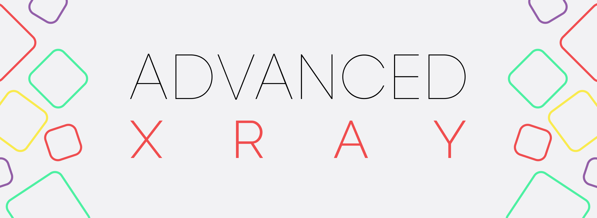

# Advanced XRay
NeoForge & Fabric based XRay mod designed to aid players who don't like the ore searching process.

-  for NeoForge
-  for Fabric

## Feature

- Built for NeoForge & Fabric
- Clean UI For Adding, Deleting and Editing the blocks you want to X-Ray
- Full RGB Colour selector
- Searchable List to find Blocks
- Add Blocks from your hand
- Add Blocks you're looking at! 
- Searchable list of blocks you've added
- Json store for the blocks you've added. Easy to edit and share!

## How to use

**Using XRay**

> Please note that these aren't always the ones set by default. Be sure to check your controls settings under `XRay` to find the correct keys*

- Press `Backslash` to toggle XRay `ON/OFF`
- Press `G` to open the `selection & settings` Gui 

**Adding Blocks**

- Open the `selection & settings` Gui
- Select the method you'd like to use to add a block, either 
  - `From hand` *will set up the basic version of the block. So no axis, facing, etc*
  - `Looking At` *Will set up the complex version of the block, good for blocks you need specifc data from*
  - `Searching a list` *Like `From hand`, it will only setup a basic block*
- Set the Name, Color, and anything else you'd like to change
- Click add and Enable the Block if it's not enabled. You can enable and disable blocks by clicking on them in the Gui.

**Editing Blocks**

- Right click on any item in the Gui and edit as needed
- Click save and the changed will be applied instantly

## Use on public servers

Don't be a dick. If the server you're playing on allows the mod, use the mod. If it doesn't, don't. Simple as. 

If you get banned from a server for using the mod, good. Don't. It's not hard to follow rules. I hold no responsibility for the way you use my mod.

Issues showing you've used the mod in a server will be closed without warning.

## A note on Shaders

Shader compatability sometimes works, and sometimes doesn't. It's very Minecraft version specific. I'm looking for help to better support shaders in general. Please create an issue or a PR if you'd like to help out.

## Game support system

I only support the last two major versions of Minecraft. For example `1.18` is the current (as of 02/2022) version of Minecraft, thus this is the First major version I support. The last long-lived versions of Minecraft was `1.16` and thus I will continue to support that until `1.18` is replaced by another long-lived version. At that point, I'll switch to `1.XX` & `1.18` for example.
