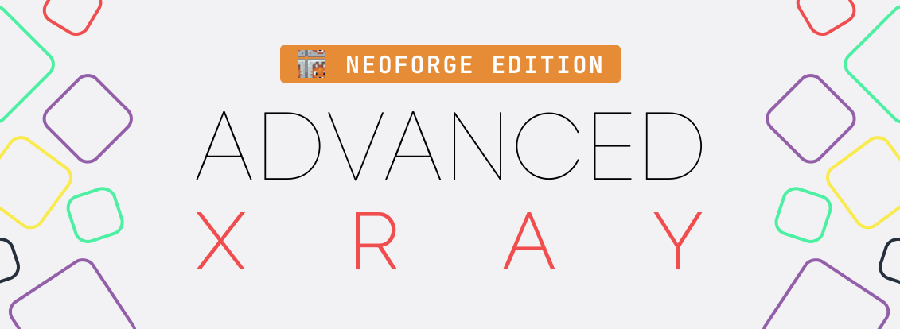

# Advanced XRay (NeoForge Edition)
Minecraft Forge based XRay mod designed to aid players who don't like the ore searching process.

 

##### Looking for the Fabric version? Click the button below :tada:

## Feature

- Built using Forge ⚒
- Clean UI For Adding, Deleting and Editing the blocks you want to X-Ray
- Full RGB Colour selector
- Searchable List to find Blocks
- Add Blocks from your hand
- Add Blocks you're looking at! 
- Searchable list of blocks you've added
- Json store for the blocks you've added. Easy to edit and share!

## Todo (TBA)

- Mob support
- Support for all fluids now it's a new system in 1.14.

## How to use

**Using XRay**

> Please note that these aren't always the ones set by default. Be sure to check your controls settings under `XRay` to find the correct keys*

- Press `Backslash` to toggle XRay `ON/OFF`
- Press `G` to open the `selection & settings` Gui 

**Adding Blocks**

- Open the `selection & settings` Gui
- Select the method you'd like to use to add a block, either 
  - `From hand` *will set up the basic version of the block. So no axis, facing, etc*
  - `Looking At` *Will set up the complex version of the block, good for blocks you need specifc data from*
  - `Searching a list` *Like `From hand`, it will only setup a basic block*
- Set the Name, Color, and anything else you'd like to change
- Click add and Enable the Block if it's not enabled. You can enable and disable blocks by clicking on them in the Gui.

**Editing Blocks**

- Right click on any item in the Gui and edit as needed
- Click save and the changed will be applied instantly

## Previews

The [Imgur Album](http://imgur.com/a/23dX5)

## Use on public servers

I **DO NOT** support the use of this mod on any public servers which do not allow this kind of mod. The mod **does** work on servers but I do not approve of, and will not, support anyone that attempts to use this mod on servers. I **do not** have the time to review each issue; I will simply close any issue with server connections in the crash log. 

If you wish to use this mod on private servers then that's on you. If you use this on public servers and are banned then that's on you and I will **not** support your use of this mod in that way. 

Join my Discord and ask about how to change the mod to use it on a server, if you can use it on servers or anything related, you will be banned without warning.

## A note on Optifine
Currently, the mod does not and has not work with Optifine since MC `1.7.x`. I am not sure why the two mods do not work 
together and due to Optfine being closed source I don't have the ability to investigate it properly. For now, I just recommend not using the two mods together. I hope to have it fixed soon. 

## A note on Minecraft Forge

As of Minecraft `1.20.5+` I am no longer supporting Minecraft Forge. I have moved to NeoForge as it a maintained, feature-rich, and more stable fork of Minecraft Forge. This will mean going forwards, this mod will no longer be usable on Minecraft Forge.

Sorry for any inconvenience this may cause.

## Game support system

I only support the last two major versions of Minecraft. For example `1.18` is the current (as of 02/2022) version of Minecraft, thus this is the First major version I support. The last long-lived versions of Minecraft was `1.16` and thus I will continue to support that until `1.18` is replaced by another long-lived version. At that point, I'll switch to `1.XX` & `1.18` for example.
